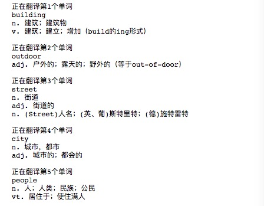

# 云起APP产品需求文档
* 首个产品需求文档“ PRD.md” 现更改为“PRD_1.0”(肤质检测app）请[参见](https://github.com/bingxin70aa/API_ML_AI/blob/master/PRD_1.0.md)

- [PRD](#前期目标PRD)
    - [加值宣言](#1产品背景介绍加值宣言)
    - [核心价值](#4产品概述及目标)
    - [核心价值与用户痛点](#2用户痛点)
    - [人工智能概率性与用户痛点](#5人工智能的概率性)
    - [需求列表与人工智能API加值](#7需求列表)
- [原型](#四产品原型)
    - [交互及界面设计](#企鹅默认页面)
    - [信息设计](#三产品功能)
- [API产品使用关键AI或机器学习之API的输出入展示](#1项目相关代码进程与展示)
    - [使用水平](#1项目相关代码进程与展示)
    - [加分项](#7需求列表)


## 前期目标PRD

文件状态 | 草稿
---|---
文档状态 | 进行中
版本 | V2.1
作者 | 侯冰昕
完成日期 | to be continued

## 修改历史

版本 | 日期 |修改内容
---|---|---
V2.1 | 2018-11-28| APP游戏化

前 V2.0-child（无添加游戏元素前） [参见](https://github.com/bingxin70aa/API_ML_AI/blob/master/PRD_2.0.md)


### 一、项目概述
#### 1、产品背景介绍(加值宣言)

* 随着全球化的发展，人们对学习英语的需求越来越强烈，学龄儿童也是（尽管绝大多数是家长希望孩子如此）。市面上k12阶段的单词学习类的app不少，但是质量参差不齐，并且主要依托于家长的积极性，而不是孩子主动学习培养出的兴趣。因此希望能够把背单词跟生活相融合，让记忆单词成为一种生活习惯，亲近并能融入生活，为深度学习英语铺路。

* 市面上很早就出现了实物翻译的app，例如百度翻译，但是由于流程较于繁琐，需要涂抹后才能够锁定目标，再进行识别；而且未让“翻译实用化”，仅是放置于整个翻译系统的“小应用”中，没有确切的用户需求，因此本产品除了可以简化识别流程外，也针对用户需求将实物翻译赋予了实际意义，使其物尽其用。

#### 2、用户痛点
* 孩子：
   
    * 仅会初期对实物翻译app有好奇心，但难以长久。
    * 百度的实物翻译的流程较繁琐，需进行涂抹后才能锁定识别对象。
    * 用户觉得单纯的单词背诵些枯燥无味，难以坚持
    * 大部分用户觉得背单词只是任务，自身无很强的动力和自制力，多数依赖父母，由其监管下进行。
    * 单词背不下来（引入艾宾浩斯记忆曲线）
* 家长：
    * 相比以前，当代家长更专注于培养孩子的兴趣，而不是是死读书的应试教育。（[极光大数据](http://www.gzqcyx.com/p/162923-248237-18953.html)）
    * 担心孩子看手机时间长，对眼睛不好


#### 3、术语和缩写解释

术语 | 解释
---|---
艾宾浩斯记忆曲线 | 遗忘率随时间的流逝而先快后慢，特别是在刚刚识记的短时间里，遗忘最快。
k12 | K12,教育类专用名词（kindergarten through twelfth grade），是学前教育至高中教育的缩写，现在普遍被用来代指基础教育。


#### 4、产品概述及目标

- name : **云起**
- 这是一款通过云养企鹅这种游戏的方式来培养孩子学习英语兴趣的习APP。
    * 主要特色功能：**游戏方面**，通过饲养养企鹅的方式来取代传统背单词APP较为功利性的打卡签到，不仅增添趣味性，还为用户记忆单词提供动能，增添用户粘性。
    * 主要特色功能：**获取单词的方式（API）**。可以通过物体识别的方式获取单词，即对准物体拍摄即可获取中文和对应的英文翻译信息，并即时可进行拼写，同时将识别过的单词加入<单词cool>中，方便再进行复习。为用户提供一个可以融入生活、**激发**出学习的**主观能动性**的单词记忆工具。

#### 5、人工智能的概率性
* 可能导致识别失败的因素及其如何解决：
    * 无法检测出物体
    * **解决方式**：弹出提示“无法检测出物体”，帮助用户重新返回到拍摄页面进行再次拍摄-涂抹-识别。
    * 物体识别出错或不匹配
    * **解决方式**：
         1. 用户可通过滑动卡片，选择性添加识别对象的单词及中文意思（见camera-4右侧的[释义](https://bingxin70aa.github.io/present_Axure/)）
         2. 创建一个用户界面，指引人们在运行分类器之前确保摄像头画面中已经出现了要分类的目标

#### 6、目标用户、使用场景
* 目标用户：主要针对5岁至18岁，对英语单词记忆有困难又提不起兴趣，对英语一窍不通或者半知半解的学龄孩童。

* 使用场景：任何时间地点

#### 7、需求列表

功能 | 用户案例 | 重要程度 | 技术领域
---|---|---|---
物体检测 | 用户想要学习物体的英文单词 |重要|[计算机视觉-Azure-REST API-分析图像](https://docs.azure.cn/zh-cn/cognitive-services/computer-vision/concept-tagging-images#image-tagging-example)
单词翻译 | 用户想要了解检测对象的中文释义 | 重要|[有道z智云API](https://ai.youdao.com/docs/doc-trans-api.s#p08)


### 二、产品角色

名称| 说明
---|---
系统管理员 | 拥有所有权限
超级饲养员 | 除个人中心权限外，解锁所有附加功能（见说明）
普通用户 | 	仅有前端个人中心的权限

### 三、产品功能

#### 1、产品功能结构图

详细[参见](http://naotu.baidu.com/file/5b20bc63ca50292ff8df5be236ec1e97?token=f53846efae32b3ab)


#### 2、产品信息结构图


详细[参见](http://naotu.baidu.com/file/0ab62f902fa8ed684cbcc9578942eb05?token=b1e3a5c414bca935)

注：*表示<超级饲养员>/购买后才拥有的功能


#### 3、物体识别流程图

[参见](https://www.processon.com/view/link/5bfe6432e4b006dc83a82a2f)


### 四、产品原型
详情见[链接](https://bingxin70aa.github.io/present_Axure/)

###### 单词cool


###### 企鹅（默认页面）


* 通过分析图像的API调用，识别出被测对象的名字并返回中文+英文注释

###### PK榜


###### 我的


### 五、产品进度
- [x] app产品框架
- [x] Azure-计算机视觉-标记图像 api 调用
- [x] 有道志云-翻译API调用
- [ ] 游戏规则

### 六、产品使用关键AI或机器学习之API的输出入展示

#### 1、项目相关代码进程与展示

* [***azure_cv_API_request***](https://github.com/bingxin70aa/API_ML_AI/blob/master/azure_cv_API_request.ipynb)

```
import requests
import matplotlib.pyplot as plt
import json
from PIL import Image
from io import BytesIO
import demjson
import pandas as pd 

# Replace <Subscription Key> with your valid subscription key.
subscription_key = "c5e128b4d9aa442f8b6dc2267a852c82"
assert subscription_key

vision_base_url = "http://api.cognitive.azure.cn/vision/v1.0/"

analyze_url = vision_base_url + "tag"

# Set image_url to the URL of an image that you want to analyze.
image_url = "https://upload.wikimedia.org/wikipedia/commons/thumb/1/12/" + \
    "Broadway_and_Times_Square_by_night.jpg/450px-Broadway_and_Times_Square_by_night.jpg"

headers = {'Ocp-Apim-Subscription-Key': subscription_key }
params  = {'visualFeatures': 'Categories,Description,Color'}
data    = {'url': image_url}
response = requests.post(analyze_url, headers=headers, params=params, json=data)
response.raise_for_status()

analysis = response.json()

data = demjson.encode(response.json())
text = demjson.decode(data)

# data['pois']是列表，含关键字搜索结果
# 大数据模块 pandas 简化输出 
df = pd.DataFrame(text['tags'])
df['name']
#列表推导
name = [x['name'] for x in text['tags']]
name
```
>['building',
 'outdoor',
 'street',
 'city',
 'people',
 'busy',
 'night',
 'ride',
 'crowd']


* [***youdao_translation_api_request***](https://github.com/bingxin70aa/API_ML_AI/blob/master/youdao_translation_api_request.ipynb)

```
# -*- coding:utf-8 -*-
from openpyxl import load_workbook
from openpyxl import Workbook
import json
import sys
from urllib.parse import urlparse, quote, urlencode, unquote
from urllib.request import urlopen
import re
 
def fetch(query_str):
    query = {'q': "".join(query_str)}   # list --> str: "".join(list)
    url = 'https://fanyi.youdao.com/openapi.do?keyfrom=11pegasus11&key=273646050&type=data&doctype=json&version=1.1&' + urlencode(query)
    response = urlopen(url, timeout=3)
    html = response.read().decode('utf-8')
    return html
 
def parse(html, num):
    d = json.loads(html)
    try:
        if d.get('errorCode') == 0:
            explains = d.get('basic').get('explains')
            result = str(explains).replace('\'', "").replace('[', "").replace(']', "")  #.replace真好用~
            sheet.cell(row=num, column=2).value = result
            num = num+1
            for i in explains:
                print(i)
        else:
            print('无法翻译!****')
            sheet.cell(row = num, column = 2).value = ' '       #若无法翻译，则空出来
            num = num + 1
    except:
        print('****翻译出错!')      #若无法翻译，则空出来
        sheet.cell(row = num, column = 2).value = ' '
        num = num + 1
 
def main():
    Sheet1 = ExcelFile['Sheet1']; num = 1
    while(1):
        word = Sheet1.cell(row = num+2, column = 1).value
        if(word != None):
            print('正在翻译第', end=''); print(num, end=''); print('个单词')
            print(word)
            parse(fetch(word), num)
            num += 1
            print()
        else:
            print('翻译结束！')
            break
    ExcelFile.close()
    out.save('out.xlsx')
 
if __name__ == '__main__':
    ExcelFile = load_workbook('/Users/rongrong/Desktop/trybook.xlsx')      #输入文件
    out = Workbook()
    sheet = out.active
    sheet.title = "out"
    main()
```



#### 2、API比较分析


#### 3、风险报告


### N、后期准备及参考资料
* [PRD推进方式及思考](http://note.youdao.com/noteshare?id=9e2e2d3a2cf39b53818b7f4095a0de5e)

* [杂乱无章](http://note.youdao.com/noteshare?id=6fd7164543137fb310dac76de65948fe)

* [Error](http://note.youdao.com/noteshare?id=414a03b9d7e9ccde11c0bbd1a79b8bbd)

    
## 清单
* [产品原型文档](https://bingxin70aa.github.io/present_Axure/#g=1)
* 前 PRD.md 现更改为PRD_1.0(肤质检测app）请[参见](https://github.com/bingxin70aa/API_ML_AI/blob/master/PRD_1.0.md)
* 已尝试调用的API的输入输出
    * [***azure_cv_API_request***](https://github.com/bingxin70aa/API_ML_AI/blob/master/azure_cv_API_request.ipynb)
    * [***youdao_translation_api_request***](https://github.com/bingxin70aa/API_ML_AI/blob/master/youdao_translation_api_request.ipynb)


